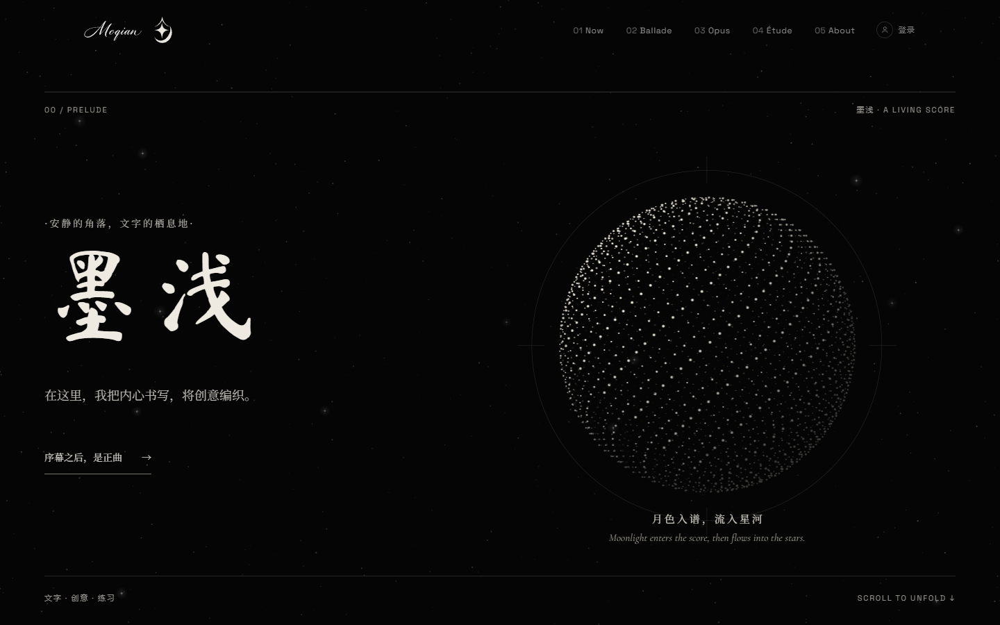
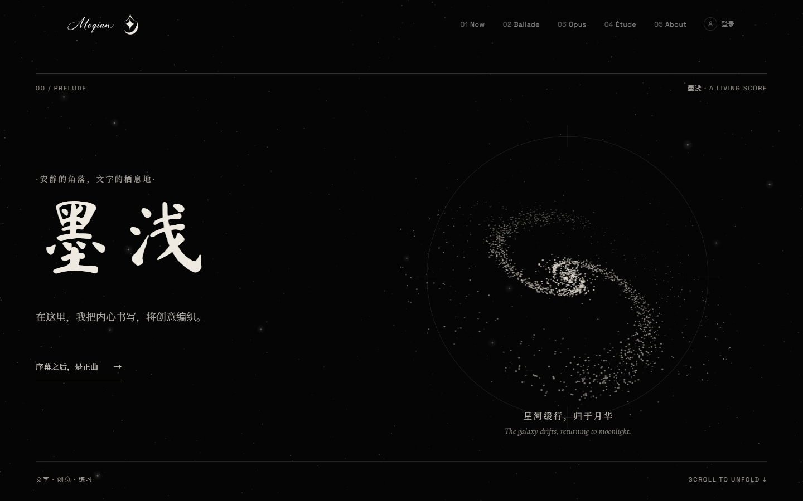
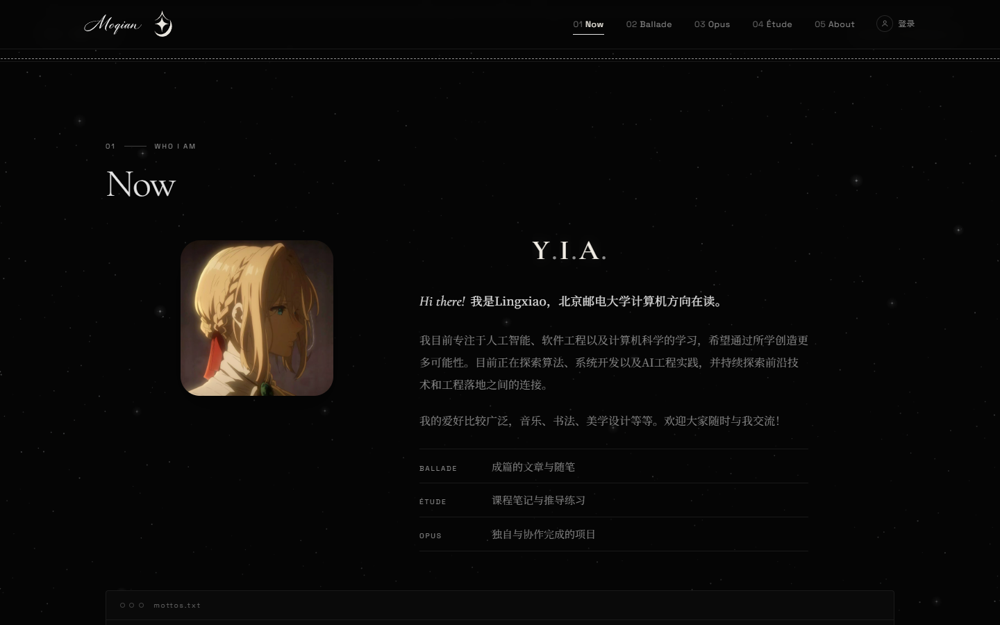
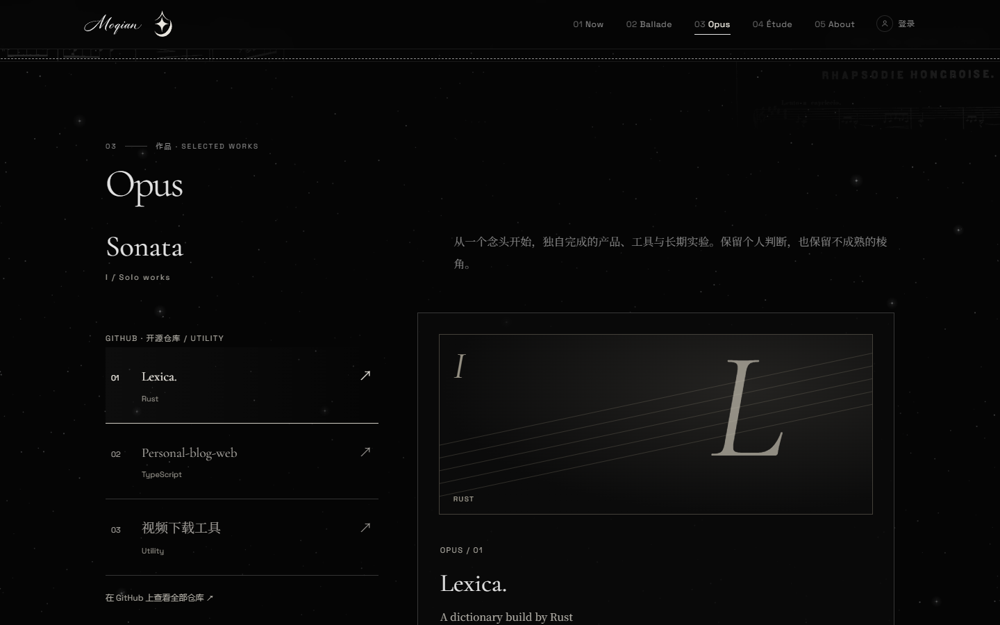
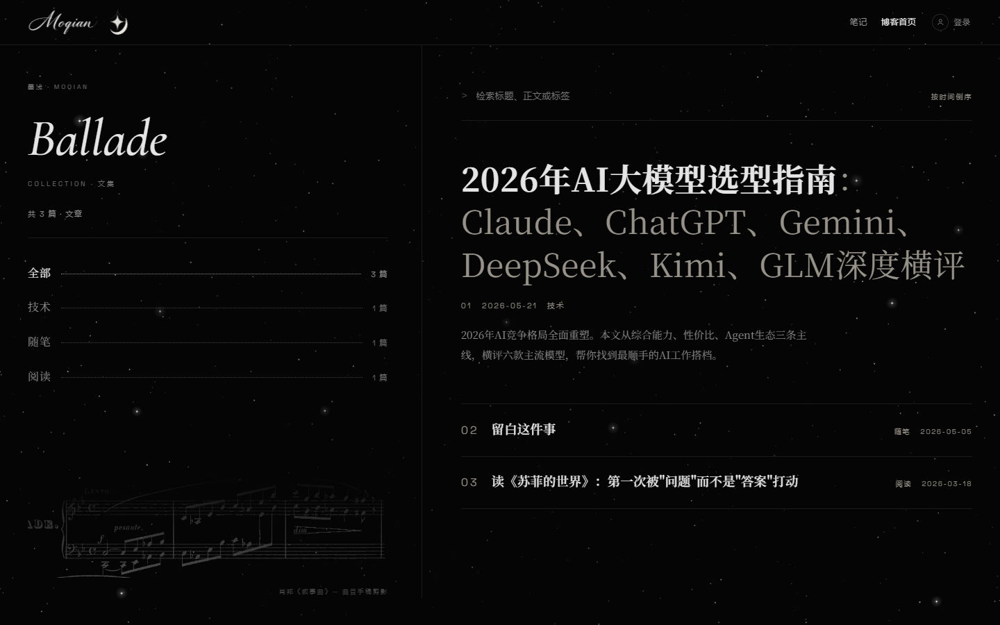
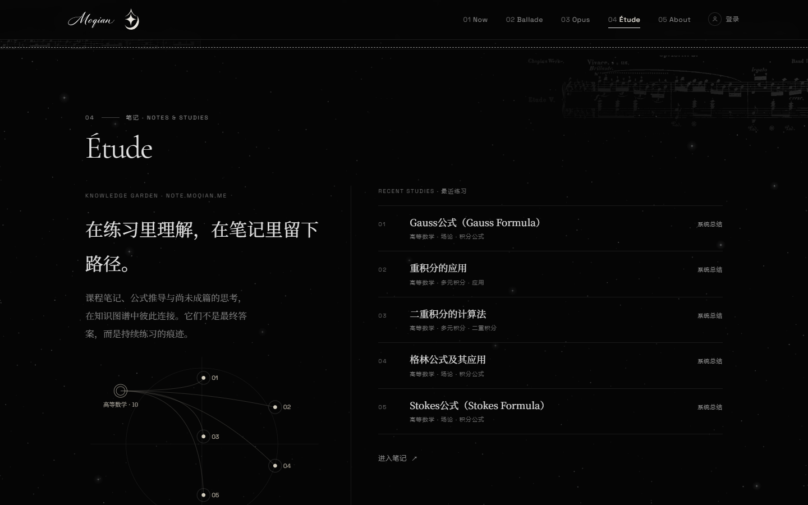

# 墨浅 · A living score

安静的角落，文字的栖息地。主页、博客与笔记共用一套灰阶乐谱：细线、编号、星野，以及一枚可以展开成星河的月。

[moqian.me](https://moqian.me/) · [博客](https://moqian.me/blog/) · [笔记](https://note.moqian.me/)

<p>
  
</p>

点月，粒子收拢后再展开为双旋臂星系。

<p>
  
</p>

## 曲式

| 乐章 | 内容 |
| --- | --- |
| Prelude | 首屏。WebGL 点阵月，点击展开星河；无 WebGL 或减少动效时回到 ASCII 月与静态星系 |
| Now | 近况。原色头像、姓名，以及 Ballade / Étude / Opus 的释义 |
| Ballade | 成篇文章。博客在 `/blog/`，编号列表、分类与搜索 |
| Opus | 作品。Sonata 为个人项目，Concerto 为正在进行的事 |
| Étude | 课程笔记与推导。首页一枚分类星图，正文在笔记站 |
| Coda | 页脚字标与星月 |

<p>
  
  
</p>

## 博客与笔记

博客是一份节目单：左侧分类，右侧按时间编号，页脚留着肖邦《叙事曲》的谱影。

<p>
  
</p>

笔记站独立部署在 `note.moqian.me`。桌面进入分类图谱，点开分类才展开笔记；移动端直接打开最新一篇。正文支持 Markdown、KaTeX 与 `[[wiki link]]`。

<p>
  
</p>

## 仓库

本仓库只放应用源码。文章与笔记留在本地，由 `.gitignore` 隔开。

| 路径 | 用途 | 开发地址 |
| --- | --- | --- |
| `New/app/` | 主页源码 | http://localhost:8080/ |
| `Home/` | 主页静态产物 | 构建后从 `New/app/dist/` 拷入 |
| `Blog/` | 博客，`base: /blog/` | http://localhost:3000/blog/ |
| `Note/` | 笔记，独立域名 | http://localhost:3001/ |
| `Site-api/` | 登录与超管上传 | http://localhost:8787/ |
| `Opus/posts/` | 博客 Markdown，不入库 | — |
| `Notes/` | 笔记 Markdown，不入库 | — |

主页开发服务把 `/blog/*` 代理到 `3000`。博客构建写出 `/blog/latest.json`，主页用它列出最近文章。

## 本地

Node.js ≥ 20.19。

```powershell
git clone https://github.com/YinLingxiao/Personal-blog-web.git
cd Personal-blog-web

npm --prefix New/app install
npm --prefix Blog install
npm --prefix Note install
npm --prefix Site-api install
```

内容是 page bundle：`<分类>/<slug>/index.md`，配图与 `index.md` 同目录，正文用 `./xxx.png` 引用。`draft: true` 不进入构建。格式见 [`Opus/README.md`](./Opus/README.md)。

```powershell
npm --prefix New/app run dev
npm --prefix Blog run dev
npm --prefix Note run dev
npm --prefix Site-api run dev
```

## 构建

```powershell
npm run quality:content-sites
npm --prefix New/app run build
npm --prefix Blog run build
npm --prefix Note run build
```

更新主页部署目录：

```powershell
Remove-Item Home/assets/* -Force
Copy-Item New/app/dist/* Home/ -Recurse -Force
```

| 地址 | 产物 |
| --- | --- |
| `https://moqian.me/` | `Home/` |
| `https://moqian.me/blog/` | `Blog/dist/` |
| `https://note.moqian.me/` | `Note/dist/` |
| `https://api.moqian.me/` | `Site-api/` |

生产环境需要 SPA history fallback。

## 技术

React 19 · Vite 7 · TypeScript · Tailwind。主页用 GSAP、Lenis、Three.js 与粒子背景。博客用 React Markdown 与 KaTeX。笔记用 D3 图谱。共享字标与动效在 `shared/`，由同步脚本写入三站。

## 许可

[MIT](./LICENSE)
