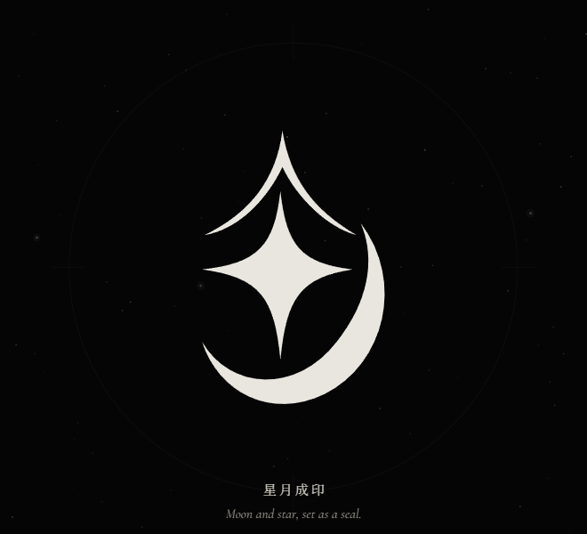
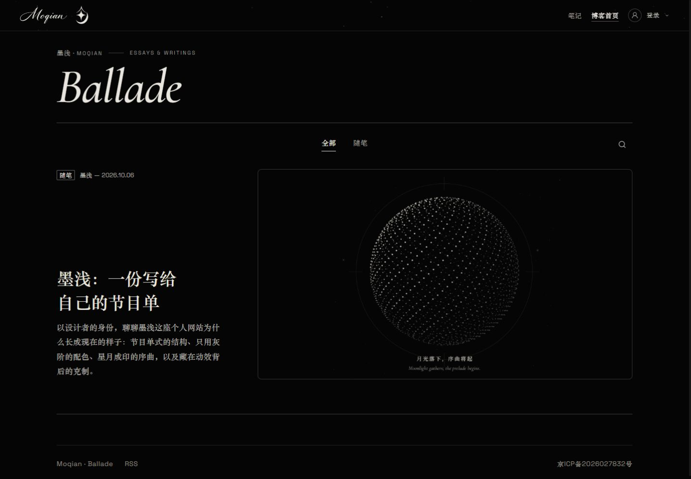
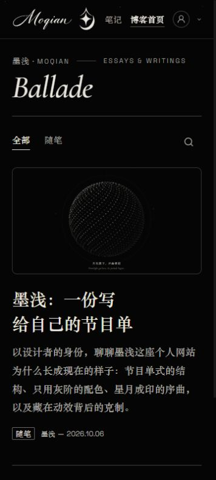

# 墨浅 Moqian

个人网站，包括主页、博客、笔记三个站点，共用一套深色灰阶设计。

[moqian.me](https://moqian.me/) · [博客](https://moqian.me/blog/) · [笔记](https://note.moqian.me/)

<p>
  
</p>

[设计](#设计) · [三个站点](#三个站点) · [留言与上传](#留言与上传) · [仓库](#仓库) · [本地](#本地) · [构建](#构建)

## 设计

### 总体

- **配色**：灰阶，不用强调色。少数例外见「色彩」。
- **字体**：正文用衬线体；日期、序号、计数等元信息用小号等宽字体。
- **版式**：用 1px 细线分隔，不加阴影，基本不用圆角。
- **栏目命名**：借用曲目名，依次是 Prelude（首屏）、Now（近况）、Ballade（博客）、Opus（项目）、Étude（笔记）、留言簿、Coda（页脚）。
- **动效**：跟随系统的「减少动效」设置，也能在页脚手动关闭。

### 首页首屏

首屏右侧是一组粒子：桌面 2400 个，手机 800 个，用 Three.js 顶点着色器绘制。

<table>
  <tr>
    <td width="50%"></td>
    <td width="50%"></td>
  </tr>
  <tr>
    <td><b>星河</b>　默认形态，点击切换为月。</td>
    <td><b>月</b>　点阵球面，自转，鼠标靠近时粒子被推开。</td>
  </tr>
  <tr>
    <td width="50%"></td>
    <td width="50%"></td>
  </tr>
  <tr>
    <td><b>聚合</b>　向下滚动，粒子依次聚成 Logo 的新月、星和光芒。</td>
    <td><b>Logo</b>　SVG 图形标接替粒子，配文「星月成印」。</td>
  </tr>
</table>

- **星河**：约 14% 的粒子构成核心，70% 沿两条对数螺线构成旋臂，其余散在外围。
- **月**：粒子按斐波那契球面分布，背光面变暗，约一成粒子显示为 `+` 字符。
- **滚动变形**：只在桌面端启用，首屏会固定约两屏高度。粒子的目标位置在 Logo 轮廓内取样，按新月、星、光芒的顺序错开出发；成形后 SVG 图形标按「月托星升」的顺序淡入，粒子退场。
- **回退**：WebGL 不可用时显示 ASCII 月和静态 SVG 星系；持续掉帧时先减少粒子、降低分辨率，仍然不行再回退；页面隐藏或滚出视口时暂停渲染。
- **提示**：首次访问时月下显示「轻触月相」，点击过一次后不再出现；切换月与星河时读屏会播报。

### 色彩

<p>
  
</p>

- 底色 `#050505`，前景暖白 `#E9E6DF`。
- 强调时沿灰阶调亮：dim → muted → fg → 纯白，纯白只用于悬停。
- 可读文字最暗用 `#8C8A85`（对比度 5.9:1）；`#555` 及更暗的灰只用于装饰。
- 分隔线 `#1A1A1A`，悬停时 `#404040`；背景分三级：`#050505`、`#0A0A0A`、`#0D0D0D`。
- 例外：笔记站正文的 wiki 链接和引用线用暖铜色（`#D4A574` / `#C8956C`）；笔记站纯色背景可选靛蓝、松绿；Google 登录图标保留品牌色；留言簿错误提示用暗红。

### 字体

<p>
  
</p>

| 用途 | 字体 | 位置 |
| --- | --- | --- |
| 字标 | 手写 Moqian，SVG 轮廓 | 页眉、页脚 |
| 书法 | Ma Shan Zheng（只含「墨」「浅」两字的子集） | 首屏大字 |
| 展示 | Cormorant Garamond 斜体 | 栏目名 |
| 正文 | 博客优先华文中宋，回退 Noto Serif SC；其余站点保持各自字体 | 中文标题与正文，博客正文行高 1.9 |
| 文楷 | LXGW WenKai | 页脚标语、引文 |
| 标记 | Space Grotesk，字距 0.12–0.22em | 日期、计数、序号 |

最小字号：桌面 11px，手机 10px。

### 首页栏目

<table>
  <tr>
    <td width="50%"></td>
    <td width="50%"></td>
  </tr>
  <tr>
    <td><b>Now</b>　自我介绍，以及一个编辑器样式的 <code>mottos.txt</code>，引文逐字打出。</td>
    <td><b>Ballade</b>　最新博文列表：编号、标题、摘要。</td>
  </tr>
  <tr>
    <td width="50%"></td>
    <td width="50%"></td>
  </tr>
  <tr>
    <td><b>Opus</b>　项目列表，分 Sonata（已完成）和 Concerto（进行中），左侧选择、右侧预览。</td>
    <td><b>Étude</b>　最新五篇笔记，左侧是分类星图。</td>
  </tr>
</table>

- **乐谱剪影**：各栏目角落有真实乐谱的剪影（肖邦、李斯特、贝多芬、柴可夫斯基），不透明度 13%–16%，进入视口时播放描线动画。
- **编号**：节标题形如 `03 —— 作品 · SELECTED WORKS`，列表前缀 `01 02 03`，博客期号 `No. 03`。
- **点线引导**：分类名与数量之间用点线连接。
- **Étude 星图**：悬停星点时，右侧列表对应的一行同步高亮；星图对读屏隐藏，信息由列表提供；手机上不显示星图。

### 动效与可访问性

- **滚动**：Lenis 平滑滚动；GSAP ScrollTrigger 控制节标题淡入和列表错峰出现；导航高亮当前一节。
- **画质分档**：桌面（宽度 ≥ 1024px 且为精细指针）启用完整效果；手机减少粒子数和分辨率；减少动效时全部静态，不加载 WebGL，笔记站背景改为纯色。
- **光标**：精细指针设备上使用自定义十字光标，输入框保持文本光标。
- **点击星座**：鼠标左键点击处出现一个星座（北斗、猎户、天蝎等 10 个，轮换出现），偶尔附带流星，或出现昴星团、牛郎织女彩蛋。三站共用；触屏、输入框和减少动效时不触发。
- **星空背景**：主页与博客阅读页共用 Canvas 星空；博客目录仅在顶栏保留星空，正文采用冷黑纯色背景。帧率上限 30fps，页面隐藏时暂停。
- **读屏与键盘**：月与星河切换按钮带 `aria-pressed` 并有播报；Étude 每篇笔记只占一个 Tab 停点；笔记图谱提供可访问列表；焦点环可见；主要按钮触控区 44px。

### 品牌

<p align="center">
  
</p>

- **字标**：手写 Moqian 转成的矢量轮廓，不依赖字体文件；首次出现时先描边再填色。
- **图形标**：顶部光芒、四芒星、新月三部分；入场动画「月托星升」共 1650ms，依次是新月、星、光芒。
- **署名**：Now 一节里的 Y.I.A. 在缩写、拼音、含义（Yearning · Ingenious · Astute）三种写法间循环变换。

## 三个站点

三个站点各自独立构建和部署，共用设计规范和 `shared/` 里的组件。

### 博客 · Ballade

<p>
  
</p>

- **目录**：参考 [Arena Blog](https://arena.ai/blog) 的开放排版，保留墨浅字标、冷黑底、双语署名和斜体 Ballade；主推文章采用左文右图，其余为三栏网格，手机为单栏。
- **封面与交互**：16:9 封面配细灰边框，悬停或键盘聚焦展开“阅读全文”；文字直接排在页面上，缺少封面时使用文字占位。
- **字体**：中文优先华文中宋，未安装时回退 Noto Serif SC 或系统宋体；英文展示与元信息保留独立字体。
- **内容**：运行时读取 Site-api 的真实文章，支持 URL 分类筛选、全文搜索、Markdown、KaTeX 与双链。独立 Demo 路由 `/blog/demo/arena` 使用示例内容展示网格，不进入真实文章目录。
- **阅读页**：保持单栏文档、可选封面、上一篇与下一篇；管理和发布流程保持原有行为。

<p>
  
</p>

### 笔记 · Étude

独立部署在 `note.moqian.me`。桌面端先进入分类图谱，点开分类再看笔记；手机端直接打开最新一篇。

<p>
  
</p>

- **图谱**：D3 绘制。实心圆是笔记，虚线圆是尚未建立的 `[[wiki link]]`，圆的大小与链接数相关；悬停时只高亮相邻节点；支持拖拽、缩放，并提供可访问列表。
- **侧栏**：顶部显示按当天日期计算的月相。
- **阅读区**：KaTeX 公式、表格、引用块、可点击的 `[[wiki link]]`。

<p>
  
</p>

- **背景**：右上角切换四种：月夜（WebGL 水面涟漪，默认）、丝流（WebGL 流场）、雨窗（Canvas 雨滴）、纯色（墨色、靛蓝、松绿等）。

<table>
  <tr>
    <td width="50%"></td>
    <td width="50%"></td>
  </tr>
  <tr>
    <td align="center">月夜</td>
    <td align="center">丝流</td>
  </tr>
  <tr>
    <td width="50%"></td>
    <td width="50%"></td>
  </tr>
  <tr>
    <td align="center">雨窗</td>
    <td align="center">纯色 · 靛蓝</td>
  </tr>
</table>

### 手机

三个站点在手机上都改为单栏：首页首屏粒子在上、文字在下；博客主推改为上图下文，文章网格改为单栏；笔记侧栏变成抽屉，宽表格可横向滚动。

<table>
  <tr>
    <td width="33%"></td>
    <td width="33%"></td>
    <td width="33%"></td>
  </tr>
  <tr>
    <td align="center">首页</td>
    <td align="center">博客</td>
    <td align="center">笔记</td>
  </tr>
</table>

## 留言与上传

首页留言簿在 About 与页脚之间，锚点是 `#guestbook`。不必登录就能阅读。登录后可以留下 1–500 字的纯文本，换行会保留，内容按文本显示。作者可以删除自己的留言，超管可以删除任意一条。列表从新到旧，每次 20 条。

超管登录后，账户菜单会打开上传页：博客是 `http://localhost:3000/blog/admin/upload`，笔记是 `http://localhost:3001/admin/upload`。上传的是一个文件夹，里面要有 `index.md`，图片与它放在一起。保存后由 Site API 发布公开内容，不必为每一篇重新构建页面。`draft: true` 只保存，不公开。已有 slug 不会被覆盖。接口、CSRF 与留言限流见 [`Site-api/README.md`](./Site-api/README.md)。

## 仓库

本仓库包含应用源码；博客与笔记的内容目录分别是 `Opus/posts/` 和 `Notes/`。独立内容仓库为 [YinLingxiaoBlog](https://github.com/YinLingxiao/YinLingxiaoBlog) 和 [YinLingxiaoNote](https://github.com/YinLingxiao/YinLingxiaoNote)。目前未配置与这两个仓库的自动同步。

| 路径 | 用途 | 开发地址 |
| --- | --- | --- |
| `New/app/` | 主页源码 | http://localhost:8080/ |
| `Home/` | 主页静态产物 | 构建后从 `New/app/dist/` 拷入 |
| `Blog/` | 博客，`base: /blog/` | http://localhost:3000/blog/ |
| `Note/` | 笔记，独立域名 | http://localhost:3001/ |
| `Site-api/` | 登录、留言与内容发布 | http://localhost:8787/ |
| `shared/` | 字标、星月、动效、账户与上传组件、星空，由脚本同步进各站 | — |
| `Opus/posts/` | 博文内容仓库的本地检出目录 | — |
| `Notes/` | 笔记内容仓库的本地检出目录 | — |

主页开发服务把 `/blog/*` 代理到 `3000`。博客和笔记的文章索引、图片、最近内容与 RSS 由 Site API 动态提供；上传成功后自动生成并发布内容，无需每篇都重建页面。

## 本地

Node.js ≥ 20.19。

```powershell
git clone https://github.com/YinLingxiao/Personal-blog-web.git
cd Personal-blog-web

npm --prefix New/app install
npm --prefix Blog install
npm --prefix Note install
npm --prefix Site-api install
```

内容是 page bundle：`<分类>/<slug>/index.md`，配图与 `index.md` 同目录，正文用 `./xxx.png` 引用。`draft: true` 不会公开。格式见 [`Opus/README.md`](./Opus/README.md)。

```powershell
npm --prefix New/app run dev
npm --prefix Blog run dev
npm --prefix Note run dev
npm --prefix Site-api run dev
```

## 构建

```powershell
npm run quality:content-sites
npm --prefix New/app run build
npm --prefix Blog run build
npm --prefix Note run build
```

更新主页部署目录：

```powershell
Remove-Item Home/assets/* -Force
Copy-Item New/app/dist/* Home/ -Recurse -Force
```

| 地址 | 产物 |
| --- | --- |
| `https://moqian.me/` | `Home/` |
| `https://moqian.me/blog/` | `Blog/dist/` |
| `https://note.moqian.me/` | `Note/dist/` |
| `https://api.moqian.me/` | `Site-api/` |

生产环境需要 SPA history fallback。

页面代码或样式更新时才需要重新部署 Home、Blog、Note 的构建产物。平时在超管上传页添加文章或笔记，Site API 会自动更新公开内容。首次启用自动发布需要一起部署新版 Site API 和三个页面；部署步骤见 [`Site-api/README.md`](./Site-api/README.md)。

## 技术

React 19 · Vite 7 · TypeScript · Tailwind。主页用 GSAP、Lenis、Three.js 与共享的 Canvas 星空。博客用 React Markdown 与 KaTeX。笔记用 D3 图谱与 WebGL / Canvas 背景。共享字标与动效在 `shared/`，由同步脚本写入各站。

## 许可

[MIT](./LICENSE)
