# 墨浅 · A living score

安静的角落，文字的栖息地。主页、博客与笔记是同一件作品的三个乐章：一套灰阶的乐谱，细线、编号、星野，以及一枚可以展开成星河的月。

[moqian.me](https://moqian.me/) · [博客](https://moqian.me/blog/) · [笔记](https://note.moqian.me/)

<p>
  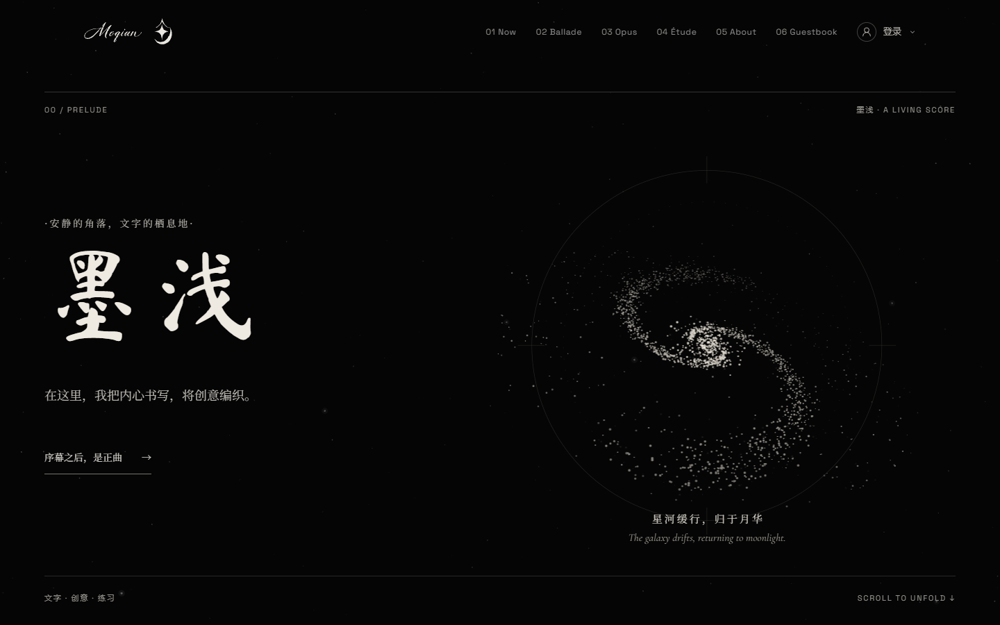
</p>

[设计](#设计) · [三个站点](#三个站点) · [留言与上传](#留言与上传) · [仓库](#仓库) · [本地](#本地) · [构建](#构建)

## 设计

### 一份节目单

墨浅不想做简历，也不想做内容频道。它更像一本印好的音乐会节目单：先是署名，然后是曲目，页边留着谱子。

曲目依次是：开场的 Prelude，一枚在星河、月与乐谱之间变形的月；Now，写给此刻的一页；Ballade 叙事曲，写得长一些的文字；Opus 作品，Sonata 收独自完成的，Concerto 是还在进行的；Étude 练习曲，没有定论的笔记与推导；一本留言簿，来过的人留下的话；最后是 Coda 尾声，一枚字标和一弯新月。

四条原则先于所有具体决定：

1. **灰阶即规则。** 颜色是结构，不是装饰。需要强调，就沿灰阶往上走。
2. **内容用衬线，注释用等宽。** 日期、序号、计数、说明，凡不是内容的东西，都用同一种小号的字距体。
3. **发丝线做结构。** 分隔与边界只用 1px 的线；内容层不投影，几乎不圆角。
4. **动效克制，并且可以关。** 动效是氛围与反馈，从不挡路。

### 序幕：一枚会变形的月

首屏只有一个主角：一团由 2400 个点组成的粒子（手机上是 800 个）。它在三种形态之间流动。

<table>
  <tr>
    <td width="50%">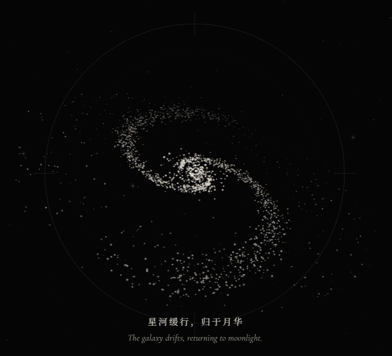</td>
    <td width="50%">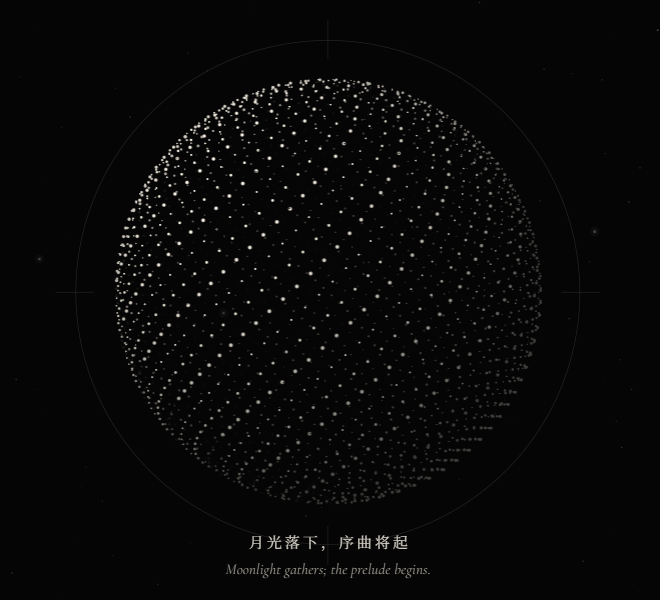</td>
  </tr>
  <tr>
    <td><b>星河</b>　首屏默认。点一下收拢为月。</td>
    <td><b>月</b>　点阵球面，光从左上方落下。</td>
  </tr>
  <tr>
    <td width="50%">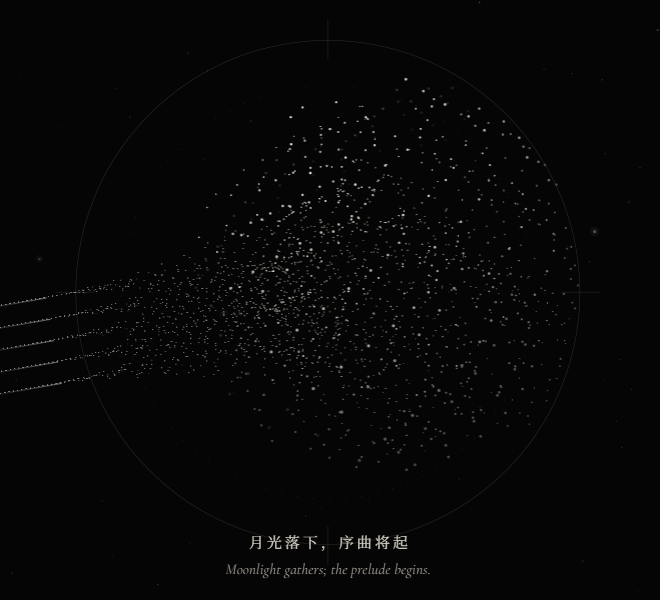</td>
    <td width="50%">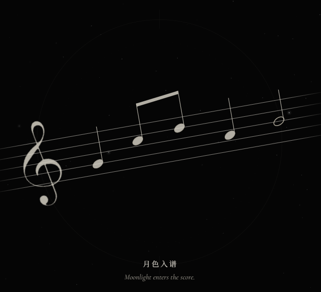</td>
  </tr>
  <tr>
    <td><b>入谱</b>　向下滚动，粒子脱离月的形状，流向谱线。</td>
    <td><b>乐谱</b>　谱号浮起，音符依次升起。</td>
  </tr>
</table>

- **月。** 点沿斐波那契球面均匀分布，背光面渐暗。约一成的点以 `+` 字符而不是圆点呈现，是 ASCII 月亮的回声。鼠标靠近时点会被轻轻推开，整颗月缓慢自转。
- **星河。** 同一批点重新排布：约 14% 聚成核球，70% 沿两条对数螺线展开成旋臂，其余散作外晕，整体倾斜成斜视的盘面。
- **乐谱。** 桌面端会把序幕钉住约两屏的高度，由滚动进度驱动变形：粒子先脱离月的形状，流向一组略微倾斜的五线谱，随后由一层 SVG 接手。五条谱线自左向右描出，高音谱号浮起，五个音符依次升起、符干生长，一束微光扫过谱号。

变形发生在顶点着色器里。每个点带着自己的随机种子，并按它在谱线上的位置错开出发时间，所以看上去是点在流向目标，而不是整体淡入淡出。

它也有退路：WebGL 不可用或上下文丢失时，序幕回到 ASCII 点阵月和静态 SVG 星系；运行中如果持续掉帧，先减少粒子并降低分辨率，仍不行才回退；页面隐藏或滚出视口时暂停渲染。切换月与星河时，读屏会播报当前状态；第一次访问，月下会淡出一行「轻触月相」，点过之后不再出现。

### 色彩：灰阶教条

整套站点没有色相。底是 `#050505`，前景是暖白 `#E9E6DF`：文字与月光出自同一光源，所以前景不会飘回冷灰白。

<p>
  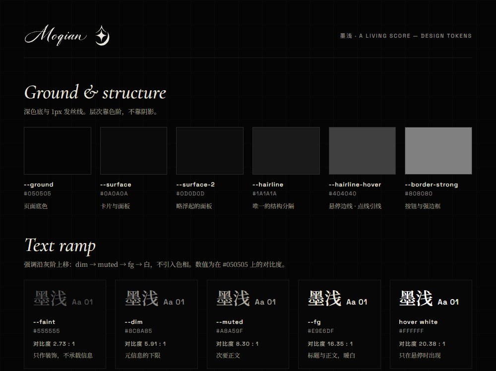
</p>

- 需要强调时，沿灰阶上移：dim → muted → fg → 纯白。纯白只在悬停时出现，是整套系统里最响的一声。
- `#8C8A85`（对比度 5.9:1）是可读文字的下限，用于日期、计数这类元信息。`#555` 及更暗的灰只做装饰：分隔符、乐谱说明、`aria-hidden` 的点缀。
- 结构只靠 1px 的 `#1A1A1A` 发丝线，悬停时升到 `#404040`；深浅层次来自 `#050505 → #0A0A0A → #0D0D0D` 三步底色。
- 例外集中在几处：笔记站阅读区的 wiki 链接与引用线用一点暖铜（`#D4A574` / `#C8956C`），让长文里的链接可辨；笔记站的纯色背景可选靛蓝、松绿；登录按钮里的 Google 图标保留品牌色；留言簿的错误提示用褪色的红。

### 字体：六种声音

<p>
  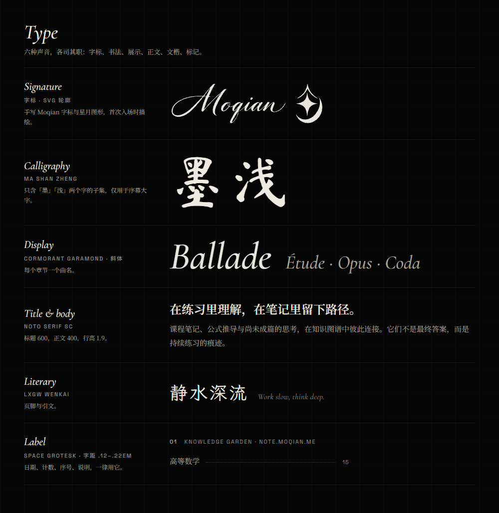
</p>

| 声音 | 字体 | 用在哪里 |
| --- | --- | --- |
| 字标 | 手写 Moqian，SVG 轮廓 | 页眉与页脚 |
| 书法 | Ma Shan Zheng，只含「墨」「浅」两字的子集 | 序幕大字 |
| 展示 | Cormorant Garamond，斜体 | 栏目曲名：Ballade、Étude、Opus |
| 正文 | Noto Serif SC | 标题与正文，正文行高 1.9 |
| 文楷 | LXGW WenKai | 页脚「静水深流」与引文 |
| 标记 | Space Grotesk，字距 0.12–0.22em | 日期、计数、序号、说明 |

标记体是整套排版的暗线。它很小，桌面不低于 11px，手机不低于 10px，但处处都在：节标题前的 `03 —— 作品 · SELECTED WORKS`，博客的期号，笔记的分类计数。

### 版式与细节

<table>
  <tr>
    <td width="50%">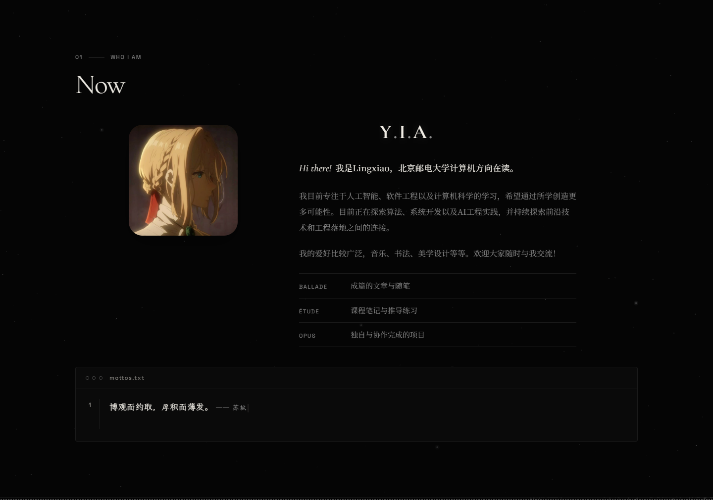</td>
    <td width="50%">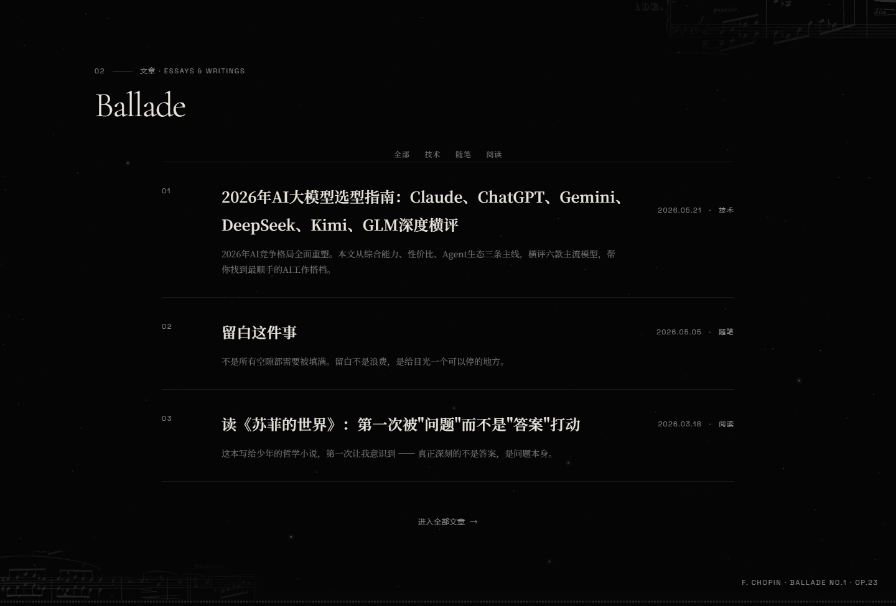</td>
  </tr>
  <tr>
    <td><b>Now</b>　一块像文本编辑器的 <code>mottos.txt</code>，逐字打出引文。</td>
    <td><b>Ballade</b>　编号、标题、摘要，没有卡片。</td>
  </tr>
  <tr>
    <td width="50%">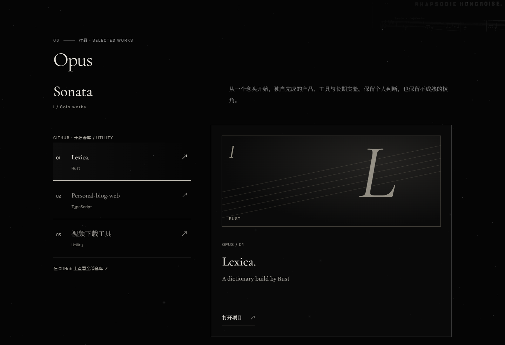</td>
    <td width="50%">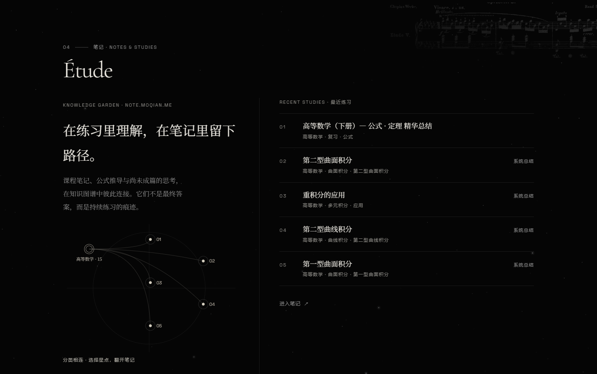</td>
  </tr>
  <tr>
    <td><b>Opus</b>　左边选，右边看；预览是斜置五线谱上的一个大写首字母。</td>
    <td><b>Étude</b>　一枚分类星图，把笔记连回分类。</td>
  </tr>
</table>

- **谱影。** 各栏目的角落里压着真实乐谱的剪影：肖邦《叙事曲》与《黑键》练习曲、李斯特《匈牙利狂想曲》、贝多芬《月光》奏鸣曲、柴可夫斯基第一钢琴协奏曲。不透明度只有 13%–16%，向角落渐隐，位于内容之下。进入视口时谱线先从一端擦出，音符再浮起，曲目写在角落里。
- **编号。** 主页的节标题是 `03 —— 作品 · SELECTED WORKS`，列表前缀是 `01 02 03`，博客用斜体期号 `No. 03`。目录是有顺序的。
- **点线引导。** 分类名与数量之间用一条点线连起来，像节目单上的曲目与页码。
- **不投影，几乎不圆角。** 层次靠底色的明暗和发丝线。头像与浮出页面的账户菜单是主要的例外。
- **Étude 星图。** 主页上的分类星图只取最新五篇笔记，悬停星点时，右侧列表里对应的一行同步高亮；它对读屏隐藏，由旁边的列表承担全部信息。手机上整张星图收起，只留列表。

### 动效与可访问性

- **滚动。** Lenis 平滑滚动，GSAP ScrollTrigger 负责节标题的淡入上升与列表的错峰出现；导航随滚动高亮当前一节。
- **减少动效。** 跟随系统，也可在页脚手动开关。开启后序幕不再钉住、不再加载 WebGL，月与星系变成静态图形，星空静止，笔记站的背景降为纯色。
- **三档画质。** 只有桌面（宽度 ≥ 1024px 且指针精细）才启用钉住的序幕；手机减少粒子数与分辨率；静态档什么都不播放。
- **光标。** 自定义十字光标只出现在精细指针的设备上；输入框始终是文本光标，触屏不受影响。
- **星空。** 主页与博客的背景是一层共享的 Canvas 星空，帧率上限 30fps，页面隐藏时暂停。
- **读屏与键盘。** 月与星河的切换是 `aria-pressed` 按钮，并有播报；Étude 每篇笔记只占一个 Tab 停点；笔记图谱附带「可访问列表」；焦点环清晰可见；导航与主要按钮的触控区为 44px。

### 品牌

<p align="center">
  
</p>

字标取自一笔手写的 Moqian，矢量化为轮廓，运行时不依赖任何字体文件。首次进入视口时先描出轮廓，再从左到右显出墨色。星月图形由尖顶光芒、长尾四芒星和右下承托的新月构成，入场动画叫「月托星升」，共 1650ms：月牙先托起，星芒与顶部光芒随后依次升起、落定。作者署名 Y.I.A. 在 Now 一节里会逐字变形，在缩写、拼音与含义（Yearning · Ingenious · Astute）三种写法之间流转。

## 三个站点

三个站点各自独立构建、部署，只在设计语言上相互引用。

### 博客 · Ballade

<p>
  
</p>

- **刊头。** 斜体曲名、一句话，三栏统计（篇目、分类、最近），下面是一条五线谱式的分隔线。
- **目录。** 一行检索，加上带计数的分类标签，按时间倒序。
- **最新一篇。** 占一张宽卡，标题以冒号为界，前半粗体、后半放轻，右侧列出期号、分类、日期与标签；其余文章进入两列卡片网格。检索或筛选时不再突出最新一篇，免得误导结果。
文章页是单栏阅读，最宽 720px，页首只有一行小字：日期、分类、标签。支持 Markdown、表格、引用、KaTeX 与 `[[wiki link]]`，可选封面横幅，页脚有 RSS。

<p>
  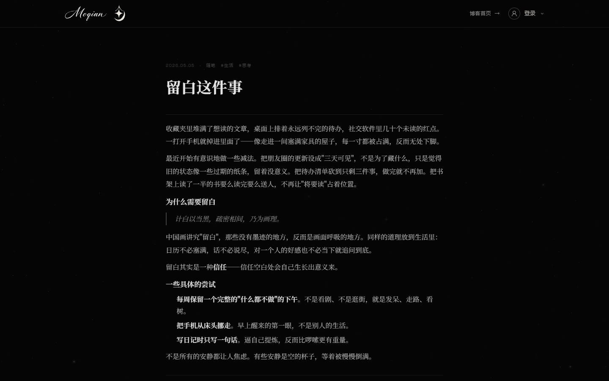
</p>

### 笔记 · Étude

笔记站独立部署在 `note.moqian.me`。桌面进入分类图谱，点开分类才展开笔记；手机直接打开最新一篇。

<p>
  
</p>

- **图谱。** 实心圆是笔记，虚线圆是尚未解析的 `[[wiki link]]`，圆的大小随链接数。悬停一个节点，它的邻居保持明亮，其余淡出。可拖拽、缩放，也可以展开「可访问列表」。
- **侧栏。** 顶部是一枚按当天日期实算的月相。
- **阅读区。** KaTeX 公式、表格、引用块，以及可点击的 `[[wiki link]]`。

<p>
  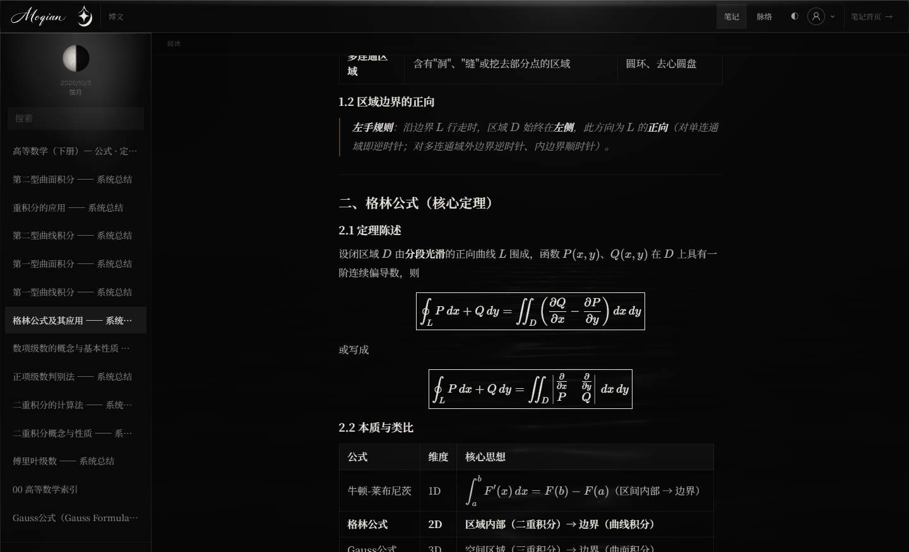
</p>

- **四种背景。** 右上角可切换：月夜（水面涟漪，WebGL 着色器，默认）、丝流（流场，WebGL）、雨窗（Canvas 雨滴）、纯色（墨色、靛蓝、松绿……）。

<table>
  <tr>
    <td width="50%">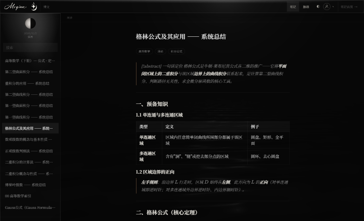</td>
    <td width="50%">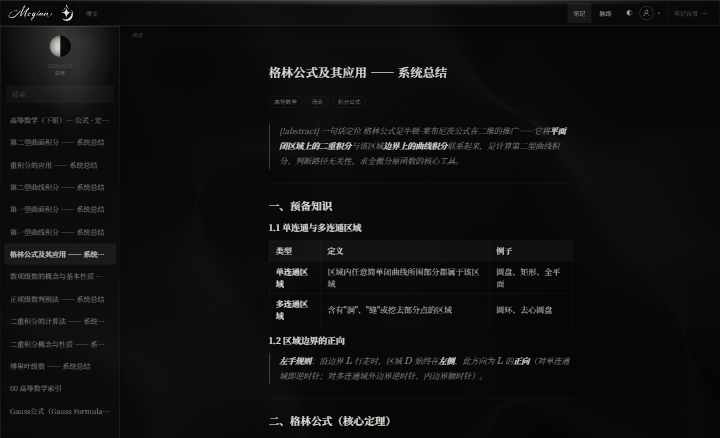</td>
  </tr>
  <tr>
    <td align="center">月夜</td>
    <td align="center">丝流</td>
  </tr>
  <tr>
    <td width="50%"></td>
    <td width="50%">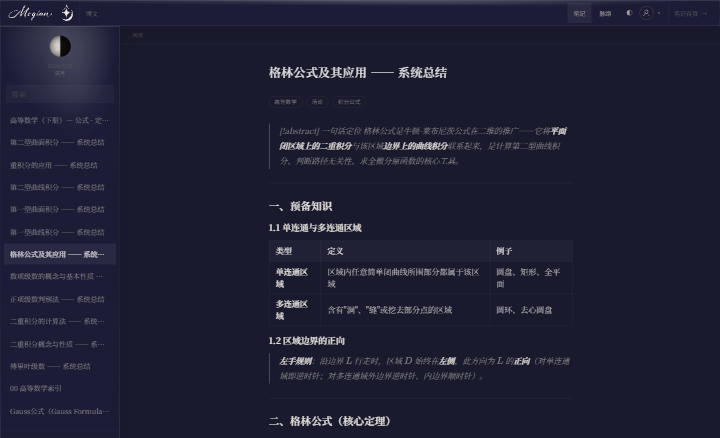</td>
  </tr>
  <tr>
    <td align="center">雨窗</td>
    <td align="center">纯色 · 靛蓝</td>
  </tr>
</table>

### 手机

同一套设计收成单栏：序幕里月在上、字在下；博客的统计移到标题下方；笔记的侧栏变成抽屉，宽表格在框内横向滚动。

<table>
  <tr>
    <td width="33%">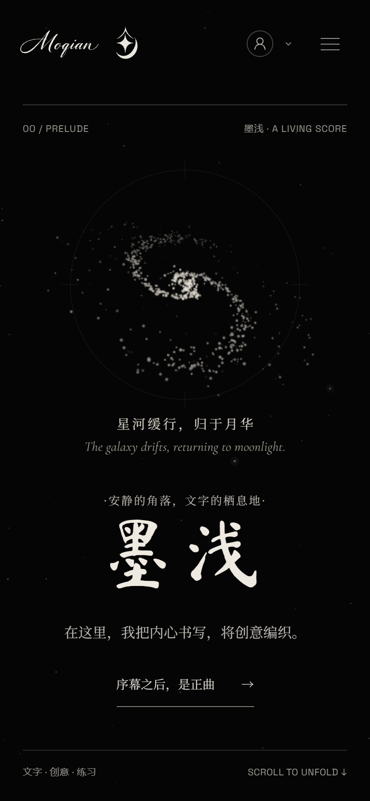</td>
    <td width="33%">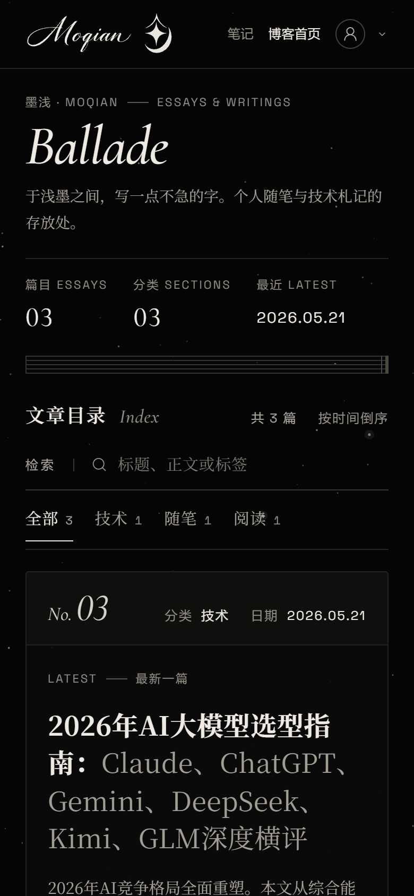</td>
    <td width="33%">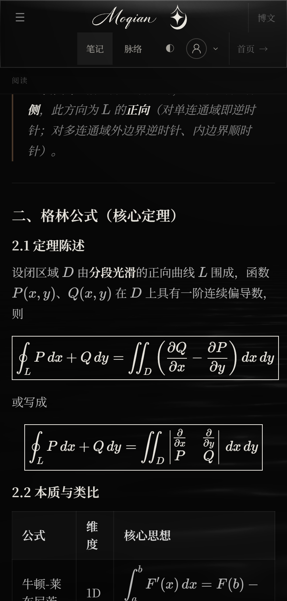</td>
  </tr>
  <tr>
    <td align="center">Prelude</td>
    <td align="center">Ballade</td>
    <td align="center">Étude</td>
  </tr>
</table>

## 留言与上传

首页留言簿在 About 与页脚之间，锚点是 `#guestbook`。不必登录就能阅读。登录后可以留下 1–500 字的纯文本，换行会保留，内容按文本显示。作者可以删除自己的留言，超管可以删除任意一条。列表从新到旧，每次 20 条。

超管登录后，账户菜单会打开上传页：博客是 `http://localhost:3000/blog/admin/upload`，笔记是 `http://localhost:3001/admin/upload`。上传的是一个文件夹，里面要有 `index.md`，图片与它放在一起。保存后由 Site API 发布公开内容，不必为每一篇重新构建页面。`draft: true` 只保存，不公开。已有 slug 不会被覆盖。接口、CSRF 与留言限流见 [`Site-api/README.md`](./Site-api/README.md)。

## 仓库

本仓库包含应用源码；博客与笔记的内容目录分别是 `Opus/posts/` 和 `Notes/`。独立内容仓库为 [YinLingxiaoBlog](https://github.com/YinLingxiao/YinLingxiaoBlog) 和 [YinLingxiaoNote](https://github.com/YinLingxiao/YinLingxiaoNote)。目前未配置与这两个仓库的自动同步。

| 路径 | 用途 | 开发地址 |
| --- | --- | --- |
| `New/app/` | 主页源码 | http://localhost:8080/ |
| `Home/` | 主页静态产物 | 构建后从 `New/app/dist/` 拷入 |
| `Blog/` | 博客，`base: /blog/` | http://localhost:3000/blog/ |
| `Note/` | 笔记，独立域名 | http://localhost:3001/ |
| `Site-api/` | 登录、留言与内容发布 | http://localhost:8787/ |
| `shared/` | 字标、星月、动效、账户与上传组件、星空，由脚本同步进各站 | — |
| `Opus/posts/` | 博文内容仓库的本地检出目录 | — |
| `Notes/` | 笔记内容仓库的本地检出目录 | — |

主页开发服务把 `/blog/*` 代理到 `3000`。博客和笔记的文章索引、图片、最近内容与 RSS 由 Site API 动态提供；上传成功后自动生成并发布内容，无需每篇都重建页面。

## 本地

Node.js ≥ 20.19。

```powershell
git clone https://github.com/YinLingxiao/Personal-blog-web.git
cd Personal-blog-web

npm --prefix New/app install
npm --prefix Blog install
npm --prefix Note install
npm --prefix Site-api install
```

内容是 page bundle：`<分类>/<slug>/index.md`，配图与 `index.md` 同目录，正文用 `./xxx.png` 引用。`draft: true` 不会公开。格式见 [`Opus/README.md`](./Opus/README.md)。

```powershell
npm --prefix New/app run dev
npm --prefix Blog run dev
npm --prefix Note run dev
npm --prefix Site-api run dev
```

## 构建

```powershell
npm run quality:content-sites
npm --prefix New/app run build
npm --prefix Blog run build
npm --prefix Note run build
```

更新主页部署目录：

```powershell
Remove-Item Home/assets/* -Force
Copy-Item New/app/dist/* Home/ -Recurse -Force
```

| 地址 | 产物 |
| --- | --- |
| `https://moqian.me/` | `Home/` |
| `https://moqian.me/blog/` | `Blog/dist/` |
| `https://note.moqian.me/` | `Note/dist/` |
| `https://api.moqian.me/` | `Site-api/` |

生产环境需要 SPA history fallback。

页面代码或样式更新时才需要重新部署 Home、Blog、Note 的构建产物。平时在超管上传页添加文章或笔记，Site API 会自动更新公开内容。首次启用自动发布需要一起部署新版 Site API 和三个页面；部署步骤见 [`Site-api/README.md`](./Site-api/README.md)。

## 技术

React 19 · Vite 7 · TypeScript · Tailwind。主页用 GSAP、Lenis、Three.js 与共享的 Canvas 星空。博客用 React Markdown 与 KaTeX。笔记用 D3 图谱与 WebGL / Canvas 背景。共享字标与动效在 `shared/`，由同步脚本写入各站。

## 许可

[MIT](./LICENSE)
